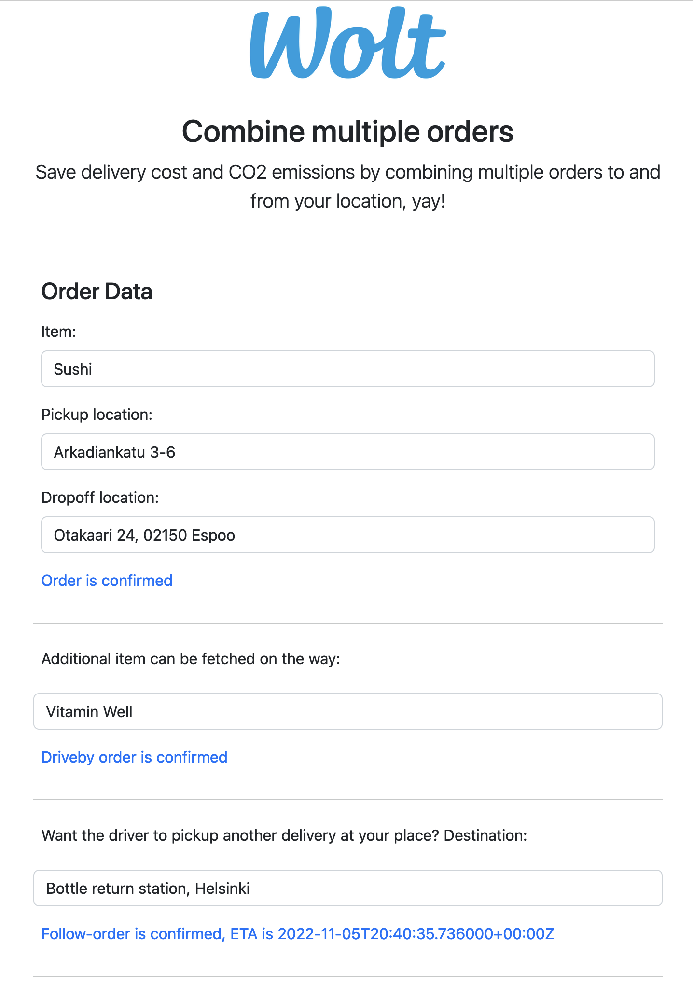

# Junction Hackathon 2022: Wolt challenge

## Showcase of combining multiple Wolt deliveries

A Wolt delivery usually takes two rides/ways: One to the pickup address and another one to the destination. To reduce the number of rides per delivery, Wolt can
- offer to deliver further items, that can be picked up on the route of the existing delivery
- offer to deliver items form the customer, after he/she received the existing delivery

By combining deliveries in this way, we can do three deliveries with only three rides, instead of the usual six rides.

